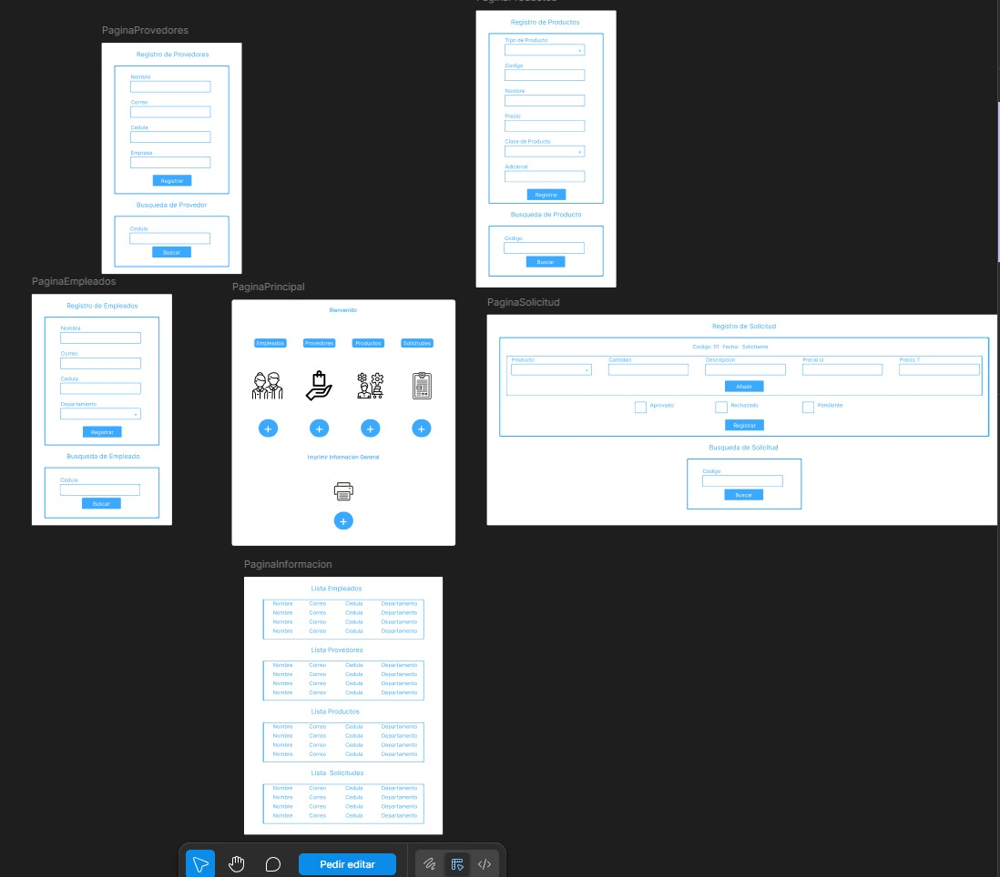
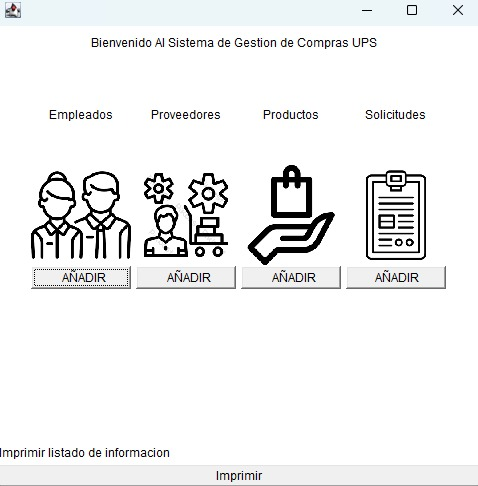
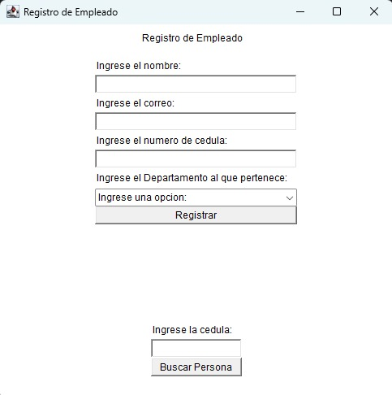
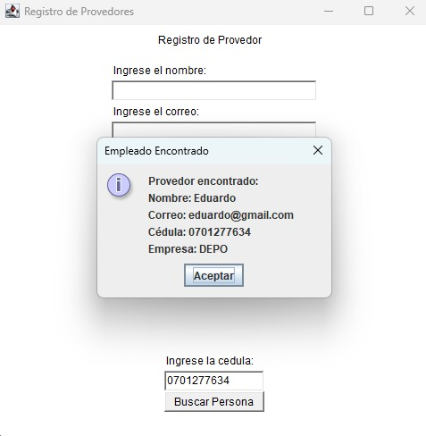
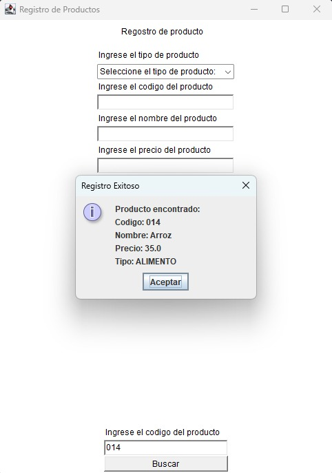
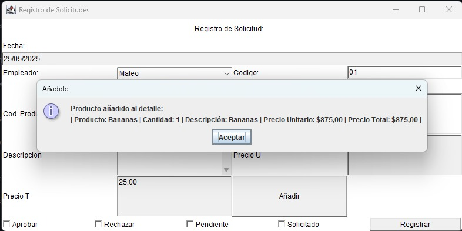
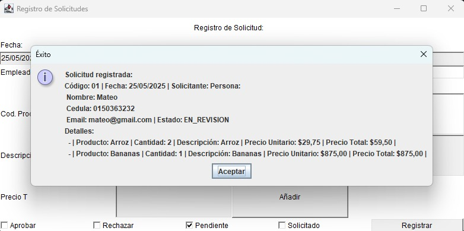
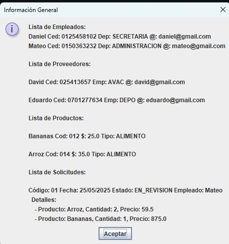

# Práctica de laboratorio 02: Diseño de una interfaz gráfica de usuario básica utilizando contenedores y componentes gráficos de Java AWT
## Diseño Figma



## 📌 Información General

- **Título:** Práctica de laboratorio 02: Diseño de una interfaz gráfica de usuario básica utilizando contenedores y componentes gráficos de Java AWT
- **Asignatura:** Programacion Orientada A Objetos
- **Carrera:** Computación
- **Estudiantes:** Mateo Eduardo Molina Chamba y Juan Pablo Ortiz Torres
- **Fecha:** 25-05-2025
- **Profesor:** Ing. Gabriel León

---

## 🛠️ Descripción
### Interfas para un Sistema de Gestión de Compras ERP:
Permite registrar proveedores, productos (artículos, paquetes y servicios) y empleados, así como crear y administrar solicitudes de compra. Cada solicitud puede cambiar su estado (solicitada, en revisión, aprobada o rechazada) y calcular su costo total basado en los productos asociados. La interacción con el usuario se realiza a través de un menú en consola, facilitando la consulta, registro, actualización y búsqueda de la información.

---

## 🚀 Ejecución

Para ejecutar correctamente el proyecto:

1. Compila el código:
    
2. Ejecuta la aplicación:

3. Importante ingresar, los proveedores, empelados y productos,
   antes de hacer las solicitudes de compra, o querer listar.
    
## 🧑‍💻 Ejemplo de Entrada







```plaintext
Link Video: https://youtu.be/XDoLDFSzGPU
```


